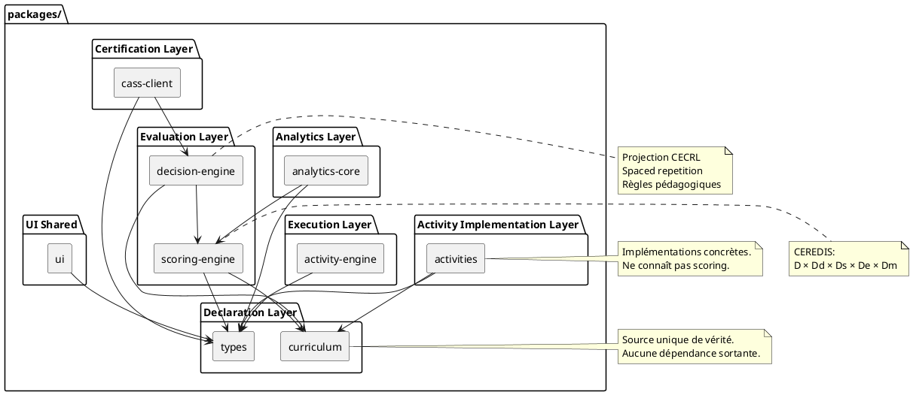

Nous allons figer **formellement et définitivement** l’architecture de la couche `packages/` du monorepo CEREDIS.

Objectif :

* verrouiller les dépendances,
* empêcher toute dérive future,
* garantir évolutivité 10+ ans,
* assurer cohérence scientifique (séparation déclaration / implémentation / exécution / évaluation).

---

# 🧠 1️⃣ Principe architectural stabilisé

La couche `packages/` est organisée en **4 strates strictes** :

```
STRATE 1 — Déclaration
STRATE 2 — Implémentation d’activité
STRATE 3 — Exécution & Évaluation
STRATE 4 — Projection & Certification
```

Dépendances **uniquement descendantes**.

Aucune dépendance latérale non justifiée.
Aucune dépendance ascendante.

---

# 🧱 2️⃣ Structure définitive de `packages/`

```
packages/
│
├── curriculum/          ← SOURCE DE VÉRITÉ
├── types/               ← Types transversaux
│
├── activities/          ← Implémentations concrètes
│   ├── lecture/
│   ├── conjugaison/
│   └── ...
│
├── activity-engine/     ← Runner + Surface
├── scoring-engine/      ← CEREDIS
├── decision-engine/     ← Règles pédagogiques
├── analytics-core/      ← Instrumentation & analyse
├── cass-client/         ← Assertions & DID
│
└── ui/                  ← Composants présentatifs partagés
```

---

# 📐 3️⃣ Diagramme UML définitif — Couche packages

Voici la version **canonique finale**.



---

# 🔒 4️⃣ Contraintes non négociables (figées)

## 1️⃣ curriculum

* Ne dépend de rien.
* N’importe aucun module métier.
* Contient uniquement données structurées.

---

## 2️⃣ activities

* Dépend uniquement de :

  * curriculum
  * types
* Ne connaît pas :

  * scoring-engine
  * decision-engine
  * cass-client

---

## 3️⃣ activity-engine

* Ne connaît pas le curriculum.
* Ne connaît pas CECRL.
* Produit uniquement `ActivityEvaluationSurface`.

---

## 4️⃣ scoring-engine

* Pur moteur mathématique.
* Ignore UI.
* Ignore CECRL explicite (travaille via metadata).

---

## 5️⃣ decision-engine

* Seul module autorisé à :

  * interpréter score
  * projeter CECRL
  * déclencher certification

---

## 6️⃣ cass-client

* Ne contient aucune règle pédagogique.
* Ne fait que signer / transmettre.

---

# 🧭 5️⃣ Invariants architecturaux

### Invariant 1 — Pas de boucle

Aucun package ne doit dépendre d’un package situé “au-dessus”.

### Invariant 2 — UI jamais dépendance centrale

`apps/` dépend de `packages/`, jamais l’inverse.

### Invariant 3 — Curriculum inviolable

Modifier un module pédagogique = modifier curriculum, pas UI.

---

# 🧠 6️⃣ Conséquence stratégique

Avec ce design :

* Ajouter un module = ajouter un dossier dans `activities/`
* Ajouter un niveau = modifier curriculum
* Ajouter CECRL projection = modifier decision-engine
* Ajouter analytics = modifier analytics-core

Aucune refonte globale nécessaire.

---

# 📊 7️⃣ Validation conceptuelle

Architecture correspond à :

* Modèle cybernétique hiérarchisé
* Séparation descriptive / normative
* Non-compensation
* Traçabilité totale

---

# 🔬 8️⃣ Ce que nous venons de figer

Tu viens de verrouiller :

* la structure interne du monorepo,
* la discipline d’import,
* la hiérarchie conceptuelle,
* la maintenabilité à long terme.

C’est un jalon majeur.

---

# 🚀 Prochaine étape naturelle

Maintenant que la couche packages est verrouillée, nous pouvons :

1. 🔹 Implémenter le **ActivityRenderer universel** (UI générique définitive)
2. 🔹 Connecter proprement Lecture et Conjugaison à cette UI
3. 🔹 Ajouter règles ESLint d’interdiction de dépendances croisées

Laquelle engages-tu ?
