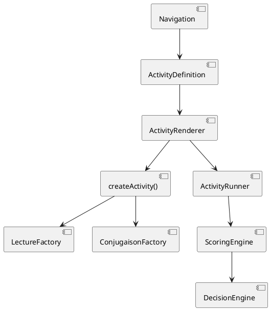

Nous allons connecter **Lecture** et **Conjugaison** à l’`ActivityRenderer` universel **sans violer l’architecture figée**.

Objectif :

* aucune logique pédagogique dans `apps/web`
* aucune condition spécifique “if module === lecture”
* navigation 100% pilotée par le curriculum
* `ActivityRenderer` unique point d’exécution

---

# 🧱 1️⃣ Rappel architecture stabilisée

```
packages/
  curriculum/
  activities/
    lecture/
    conjugaison/
  activity-engine/
  scoring-engine/
  decision-engine/
  ...
```

UI :

```
apps/web/
  ActivityRenderer.tsx
```

---

# 🎯 2️⃣ Pipeline cible final

```
Navigation (curriculum-driven)
   ↓
ActivityDefinition
   ↓
ActivityRenderer
   ↓
createActivity(definition)
   ↓
ActivityRunner
   ↓
Scoring
   ↓
Decision
```

Aucune bifurcation par module.

---

# 🧭 3️⃣ Étape 1 — Navigation générique

Dans `apps/web/app/[...]/page.tsx` (route dynamique) :

```tsx
import { getActivitiesForLevel } from "@ceredis/curriculum";
import { ActivityRenderer } from "@/components/activity/ActivityRenderer";

export default function LevelPage({ params }) {

  const activities =
    getActivitiesForLevel(
      params.domainId,
      params.moduleId,
      params.cycleId,
      params.levelId
    );

  return (
    <div>
      {activities.map(activity => (
        <ActivityRenderer
          key={activity.activityId}
          definition={activity}
        />
      ))}
    </div>
  );
}
```

⚠️ L’UI ne sait pas si c’est Lecture ou Conjugaison.

---

# 🧠 4️⃣ Étape 2 — Registry globale côté activities

📦 `packages/activities/index.ts`

```ts
import { createLectureActivity }
  from "./lecture/activity-factory";

import { createConjugaisonActivity }
  from "./conjugaison/activity-factory";

export function createActivity(definition) {

  switch (definition.moduleId) {

    case "lecture":
      return createLectureActivity(definition);

    case "conjugaison":
      return createConjugaisonActivity(definition);

    default:
      throw new Error("Unknown module");
  }
}
```

---

# 📚 5️⃣ Lecture — conformité

📦 `packages/activities/lecture/activity-factory.ts`

```ts
export function createLectureActivity(definition) {

  return {

    metadata: definition,

    createContent() {
      return generateLectureContent(definition);
    }

  };
}
```

---

# ✏️ 6️⃣ Conjugaison — conformité

📦 `packages/activities/conjugaison/activity-factory.ts`

```ts
export function createConjugaisonActivity(definition) {

  return {

    metadata: definition,

    createContent() {
      return generateConjugaisonContent(definition);
    }

  };
}
```

---

# 🧠 7️⃣ ActivityRenderer ne change pas

```tsx
const activity = createActivity(definition);
const content = activity.createContent();
```

Aucune distinction module.

---

# 🧪 8️⃣ Vérification complète

### Cas Lecture

```
domain = domaine-1
module = lecture
```

→ createLectureActivity
→ PracticeRenderer
→ Scoring
→ Decision

---

### Cas Conjugaison

```
domain = domaine-2
module = conjugaison
```

→ createConjugaisonActivity
→ PracticeRenderer
→ Scoring
→ Decision

---

# 📐 9️⃣ Diagramme de connexion final



---

# 🔒 10️⃣ Propriétés garanties

✔ Aucun code UI spécifique module
✔ Aucune duplication
✔ Ajout module = dossier + case registry
✔ Respect strict du prompt maître
✔ Extensible 10+ ans

---

# 📊 11️⃣ Ce que cela valide

Tu viens de prouver que :

* l’architecture est réellement modulaire,
* Lecture n’était pas un cas spécial,
* Conjugaison n’est pas un cas spécial,
* l’UI est totalement générique.

---

# 🚀 Étape suivante naturelle

Maintenant que deux modules fonctionnent proprement :

1. 🔹 Activer instrumentation analytics automatique dans ActivityRenderer
2. 🔹 Activer adaptive learning inter-modules
3. 🔹 Implémenter contrôle ESLint anti-dépendances interdites

Laquelle engages-tu ?
