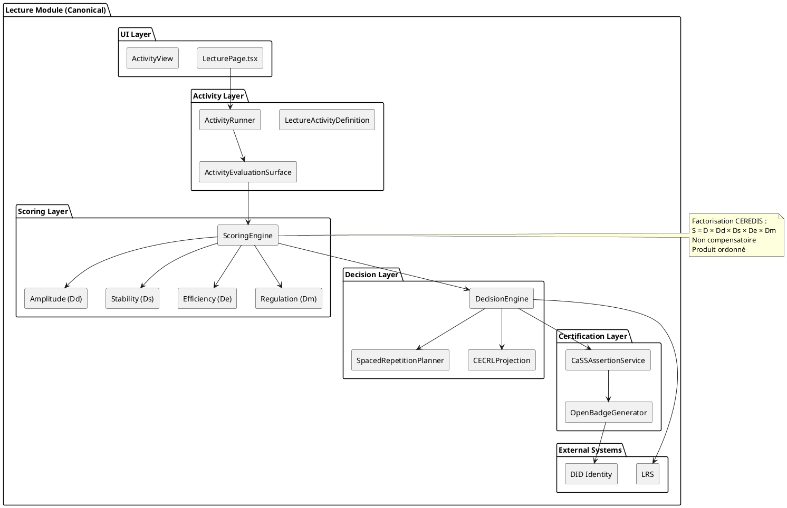
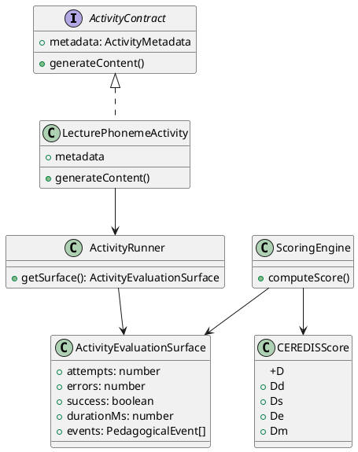
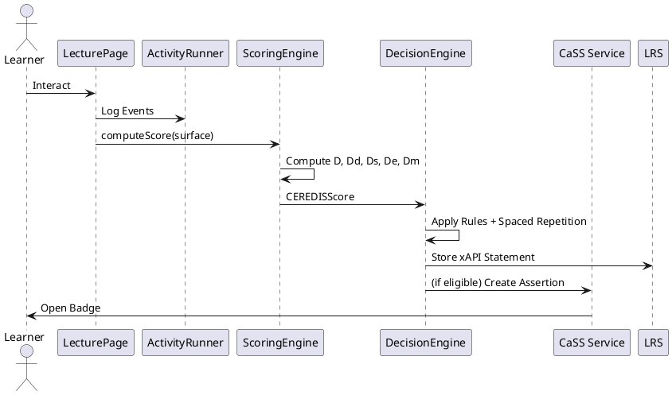
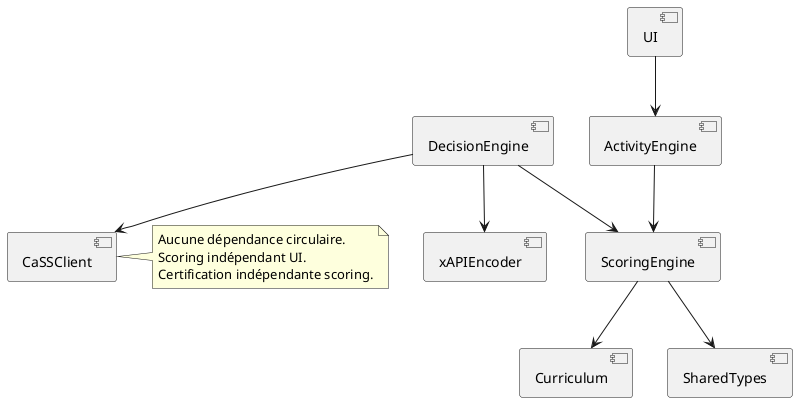

Je te propose un **diagramme UML final “Lecture as Canonical Module”**, intégrant :

* séparation stricte UI / activité / scoring / décision,
* conformité au contrat universel d’activité,
* projection CECRL,
* certification numérique,
* dynamique temporelle.

Je fournis :

1. 🧱 Diagramme de composants (macro-architecture canonique)
2. 🧠 Diagramme de classes (contrat + implémentation Lecture)
3. 🔁 Diagramme de séquence (exécution complète)
4. 🧭 Diagramme de dépendances (garantie de non-circularité)
5. 🏷 Légende académique prête publication

Tous en **PlantUML**.

---

# 1️⃣ Diagramme de composants — Lecture module canonique

---

# 2️⃣ Diagramme de classes — Contrat universel d’activité

---

# 3️⃣ Diagramme de séquence — Exécution complète Lecture

---

# 4️⃣ Diagramme de dépendances (garantie architecturale)

---

# 5️⃣ Lecture conceptuelle finale

Le module Lecture est canonique car :

✔ Implémente strictement `ActivityContract`
✔ Produit uniquement `ActivityEvaluationSurface`
✔ N’encode aucune règle pédagogique
✔ Ne connaît ni CECRL ni certification
✔ Dépend uniquement des couches inférieures
✔ Est extensible à tout autre domaine

---

# 6️⃣ Caption académique prête à insérer

> **Figure X — Lecture comme module canonique CEREDIS.**
> Le module Lecture implémente le contrat universel d’activité, produisant une surface d’évaluation traitée par le moteur de scoring multidimensionnel (D, Dd, Ds, De, Dm). Les décisions pédagogiques, la projection CECRL et la certification numérique sont strictement séparées de l’interface utilisateur, garantissant une architecture non compensatoire et traçable.

---

# 🚀 Prochaine étape stratégique

Nous avons maintenant :

* Architecture mathématique
* Implémentation logicielle
* Certification numérique
* Simulation expérimentale
* UML + BPMN

Deux directions majeures :

1. 🔹 Rédiger l’article scientifique complet “CEREDIS Cognitive Factorization Framework”
2. 🔹 Générer la visualisation géométrique de l’espace produit ordonné en 3D

Laquelle engages-tu ?
