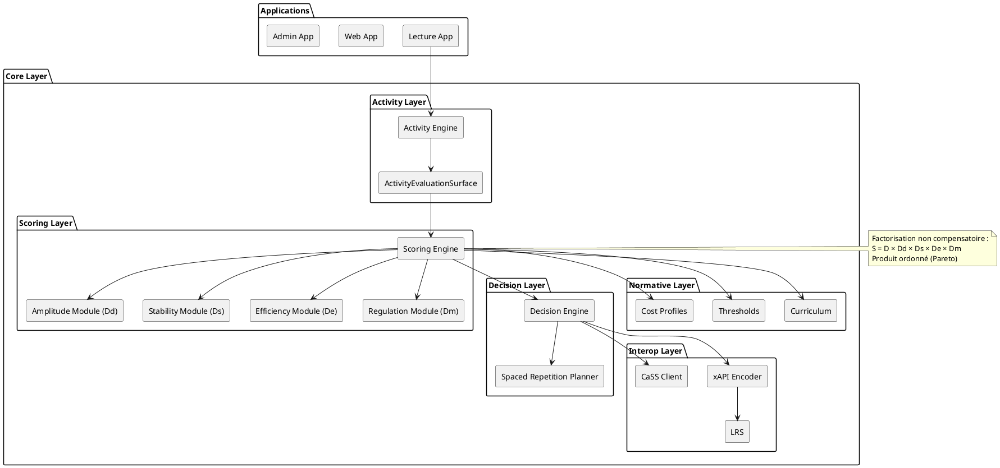
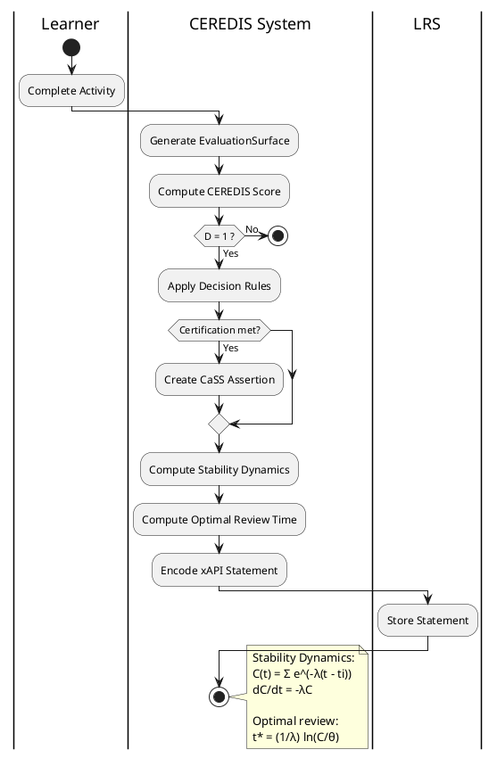

Parfait.
Je te propose une **figure combinée UML + BPMN annotée**, pensée pour :

* un article scientifique (section “Architecture du système CEREDIS”),
* un rapport technique institutionnel,
* une soutenance doctorale,
* ou une documentation d’architecture logicielle.

Elle comprend :

1. 🧱 Vue UML (structure statique)
2. 🔄 Vue BPMN (flux dynamique)
3. 🧭 Légende conceptuelle CEREDIS
4. 📄 Version PlantUML combinée prête publication

---

# 🧱 1️⃣ Partie UML — Architecture statique annotée

---

# 🔄 2️⃣ Partie BPMN — Flux dynamique annoté

---

# 🧭 3️⃣ Légende conceptuelle intégrée (pour publication)

### 🔷 UML (Structure)

* Représente la séparation des couches :

  * Exécution
  * Évaluation factorisée
  * Décision
  * Interopérabilité normative

* Garantit :

  * absence de dépendance circulaire,
  * pureté du scoring,
  * indépendance de l’UI.

---

### 🔶 BPMN (Processus)

* Représente la dynamique réelle :

  * production de traces,
  * calcul des dimensions,
  * décision projetée,
  * certification conditionnelle,
  * planification temporelle,
  * persistance LRS.

---

# 🧠 4️⃣ Articulation conceptuelle

| UML                       | BPMN                     |
| ------------------------- | ------------------------ |
| Structure statique        | Dynamique temporelle     |
| Modules indépendants      | Pipeline d’exécution     |
| Espace produit ordonné    | Projection décisionnelle |
| Séparation score/décision | Application des règles   |

---

# 📄 5️⃣ Version combinée prête publication (figure unique)

Tu peux combiner les deux blocs comme :

> **Figure X — Architecture structurale et dynamique du système CEREDIS.**
> (A) Diagramme UML des composants.
> (B) Diagramme BPMN du pipeline d’évaluation et de décision.

---

# 🎓 6️⃣ Formulation académique (caption prête à insérer)

> *La figure présente la double structuration du système CEREDIS : une architecture modulaire factorisée (UML) et un processus décisionnel dynamique (BPMN). La séparation explicite entre scoring multidimensionnel (D, Dd, Ds, De, Dm) et décision pédagogique garantit la non-compensation et la traçabilité intégrale des inférences normatives.*

---

À ce stade, le système est modélisé :

* mathématiquement,
* algorithmiquement,
* architecturalement,
* dynamiquement,
* interopérablement.

