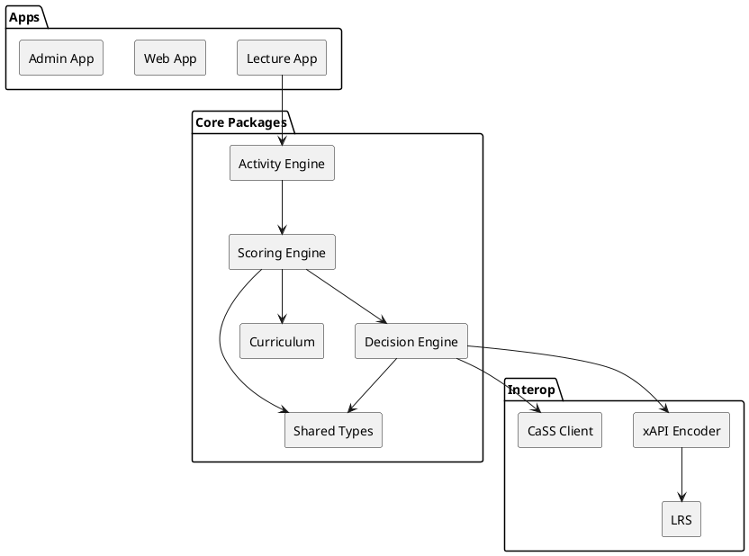
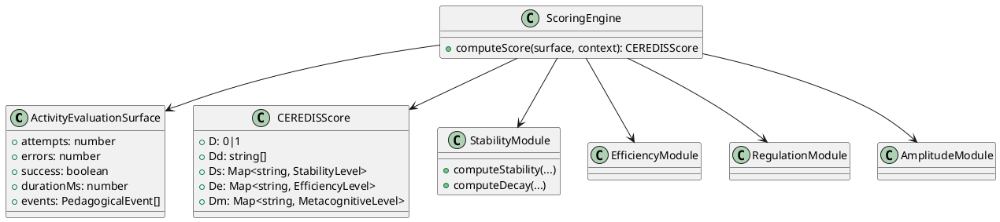
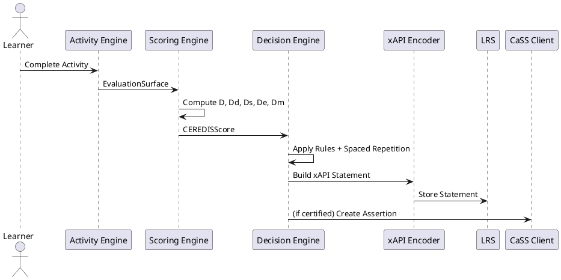
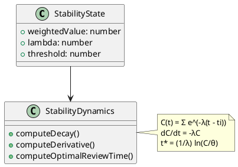
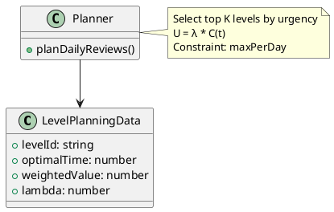
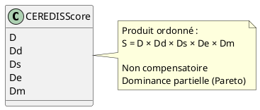

Je vais générer un **schéma UML complet annoté** couvrant :

* architecture des packages,
* relations de dépendance,
* flux de données,
* séparation score / décision,
* dynamique temporelle,
* intégration LRS + CaSS.

Je fournis :

1. 📐 Diagramme de composants (architecture globale)
2. 🧠 Diagramme de classes (cœur scoring)
3. 🔁 Diagramme de séquence (pipeline complet)
4. ⏱ Diagramme dynamique (stabilité temporelle)

Tous en **PlantUML**, directement exploitables.

---

# 1️⃣ Diagramme de composants (Architecture globale)

---

# 2️⃣ Diagramme de classes — Cœur scoring CEREDIS

---

# 3️⃣ Diagramme de séquence — Pipeline complet

---

# 4️⃣ Diagramme dynamique — Stabilité temporelle

---

# 5️⃣ Diagramme de planification globale

---

# 6️⃣ Vue conceptuelle — Espace produit ordonné

---

# 7️⃣ Lecture synthétique de l’architecture

Le système est structuré en 4 couches :

1. **Exécution**
2. **Évaluation factorisée**
3. **Décision projetée**
4. **Interopérabilité normative**

Chaque couche :

* dépend uniquement de la précédente,
* n’introduit aucune circularité,
* respecte la séparation descriptive / normative.

---

